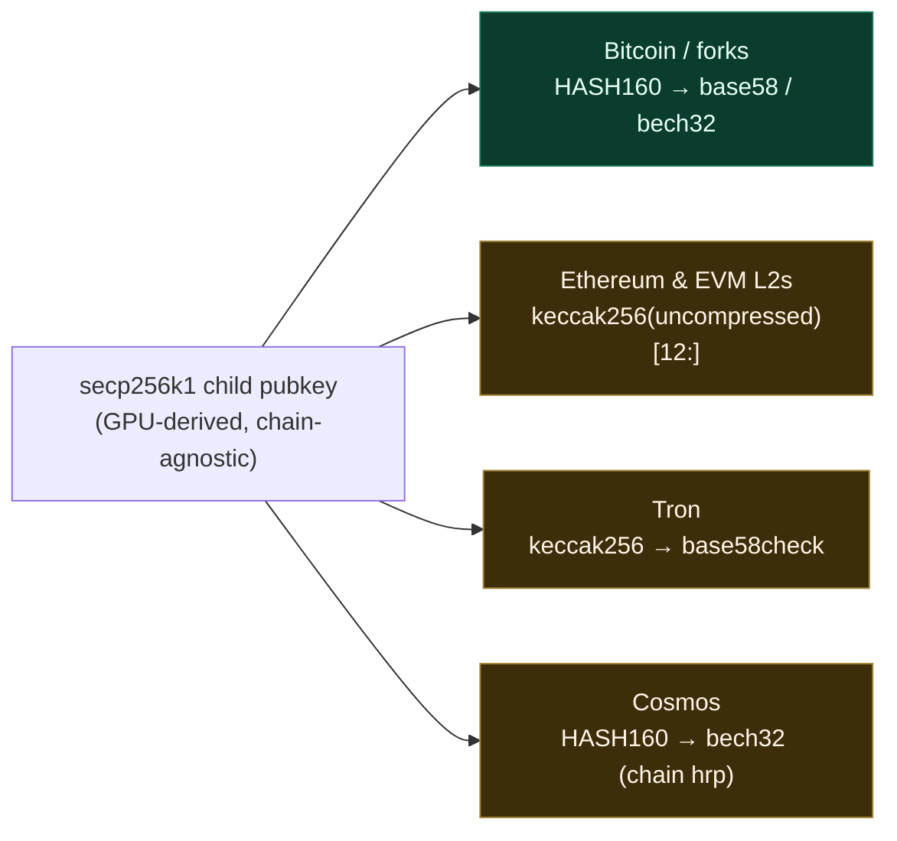
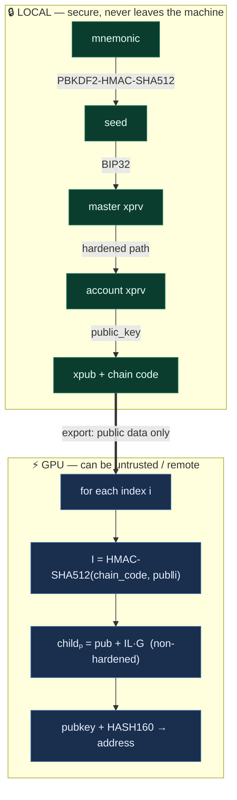
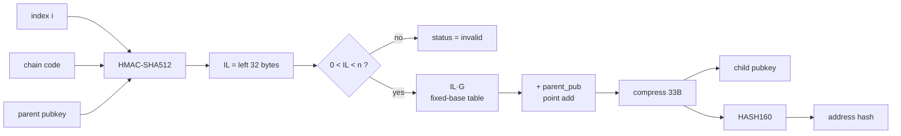

# blind-derivation

*[中文文档](README.zh-CN.md)*

**GPU-accelerated HD-wallet address derivation for secp256k1 chains — your private keys never leave the machine.**

`blind-derivation` splits HD wallet address generation into two phases so that the heavy, parallelizable work can be safely outsourced to a GPU (local or remote) **without ever exposing secret key material**:

1. **Local / secure** — mnemonic → seed → `xpub` (private keys stay put).
2. **GPU / outsourceable** — `xpub` → millions of child public keys / addresses, computed entirely on-device.

Because non-hardened BIP32 derivation needs only the public key and chain code, the GPU works **blind**: it can generate every public key but can never reverse them to a private key. That's the "blind" in blind-derivation.

The GPU computes the expensive, **chain-agnostic** core — non-hardened secp256k1 child public keys — which every secp256k1 chain shares (Bitcoin & forks, Ethereum & EVM L2s, Tron, Cosmos, …). See [Multi-chain support](#multi-chain-support).

> ⚡ Real, measured GPU derivation — **~2.0–2.7M addresses/sec on an RTX 3070 Laptop**, ~16–20× a 16-thread CPU. Not a simulation.

---

## Why

Generating large address ranges (exchange deposit walls, watch-only wallets, gap-limit scans, vanity search, analytics) is embarrassingly parallel but secret-sensitive. The usual options force a bad trade-off: do it slowly on a trusted machine, or ship key material to fast hardware you don't fully trust.

This project removes the trade-off. The secret-bearing step (PBKDF2 + hardened BIP32) runs locally and emits only an `xpub`. Everything after that — HMAC-SHA512, secp256k1 point math, HASH160 — runs on the GPU from public data alone.

---

## Features

- **Two-phase secure model** — mnemonic/seed/xprv never leave the local process; only `xpub` + chain code are exported.
- **Real CUDA kernels** — secp256k1 field & group arithmetic, fixed-base `k·G`, HMAC-SHA512, SHA-256, RIPEMD-160, all implemented on-device. No CPU fallback on the GPU path.
- **Byte-for-byte correctness** — every GPU result is validated against a pure-Rust CPU oracle (`k256` + the project's own BIP32) in the test suite.
- **Three build modes** — real GPU (`cuda`), CPU simulation for GPU-less dev (`cuda-sim`), or pure-CPU default.
- **Chain-agnostic core** — the GPU derives secp256k1 child public keys shared by all secp256k1 chains; Bitcoin address encoding is built in, others reuse the same pubkeys (see [Multi-chain support](#multi-chain-support)).
- **Address types** — P2PKH (legacy), P2WPKH (native SegWit / bech32), P2SH-P2WPKH (wrapped SegWit).
- **CLI + library** — use it as a binary or embed the crate.

---

## Performance

Measured on an NVIDIA RTX 3070 Laptop (sm_86), release build, end-to-end including host↔device transfer:

| Path | Throughput | vs CPU |
|------|-----------:|-------:|
| CPU baseline (16 threads, rayon) | ~130k addr/s | 1× |
| GPU, naive double-and-add | ~302k addr/s | ~2.4× |
| **GPU, fixed-base table** (current) | **~2.0–2.7M addr/s** | **~16–20×** |

The fixed-base windowed table replaces 256 point-doublings per scalar with ≤32 additions. The per-point modular inverse (for affine conversion) is now the dominant cost — see [Roadmap](#roadmap).

---

## Multi-chain support

The hard part the GPU does — non-hardened BIP32 derivation of **secp256k1 child public keys** — is identical for *every* chain that uses the secp256k1 curve. Only the final, cheap **address-encoding** step differs per chain, and it runs on the host on already-derived public keys.



| Family | Examples | Pubkey derivation (GPU) | Address encoding |
|--------|----------|:-----------------------:|------------------|
| **Bitcoin & forks** | BTC, LTC, DOGE, BCH | ✅ shared | ✅ **built in** (P2PKH / P2WPKH / P2SH-P2WPKH) |
| **Ethereum / EVM** | ETH, BSC, Polygon, Base, Arbitrum | ✅ shared | 🔜 `keccak256(uncompressed_pubkey)` — bring your own / on roadmap |
| **Tron** | TRX | ✅ shared | 🔜 keccak256 + base58check |
| **Cosmos** | ATOM, Osmosis | ✅ shared | 🔜 bech32 with chain HRP |

> The GPU kernel currently outputs the **compressed child pubkey + Bitcoin HASH160**. For other secp256k1 chains, reuse the same pubkeys and apply that chain's (inexpensive) encoding on the host. Built-in encoders for EVM/Tron/Cosmos are on the [Roadmap](#roadmap). Note BIP44 coin types differ per chain (`m/44'/0'` BTC, `m/44'/60'` ETH, `m/44'/195'` Tron) — that's just the local-phase derivation path. Chains on other curves (Solana/ed25519) are **out of scope**.

---

## Security model



- Mnemonic, seed, and private keys **never** cross the local/GPU boundary.
- Only non-hardened derivation is performed on the GPU; it is mathematically impossible to recover a private key from `xpub` + child public keys.
- The GPU can be a remote rented box — it only ever sees public data.

> ⚠️ **Not yet audited.** This is research-grade software. The BIP39 checksum is not validated (wordlist membership only), and the code has not undergone a security review. Do not use it to custody funds without your own review. See [Caveats](#caveats).

---

## Quick start

### Requirements

- Rust (stable, edition 2021)
- For the GPU path: CUDA Toolkit 12.x with `nvcc` on `PATH`, and an NVIDIA GPU (sm_70+). The build targets `sm_86` by default; override with `CUDA_ARCH` (e.g. `CUDA_ARCH=sm_89`).

### Build

```bash
# Pure CPU (no GPU needed)
cargo build --release

# Real GPU (requires CUDA toolkit + NVIDIA GPU)
cargo build --release --features cuda

# CPU simulation of the GPU API (for GPU-less development)
cargo build --release --features cuda-sim
```

### CLI

```bash
# 1. LOCAL: derive an xpub from your mnemonic (keep the mnemonic secret!)
cargo run --release -- derive-xpub \
    --mnemonic "abandon abandon ... about" \
    --path "m/84'/0'/0'"

# 2. Batch derive addresses from an xpub (safe to outsource)
cargo run --release -- batch-derive --xpub xpub6... --start 0 --count 1000

# 3. End-to-end demo: mnemonic → xpub → addresses
cargo run --release -- demo --count 20

# 4. CPU benchmark
cargo run --release -- benchmark --count 100000

# 5. List CUDA devices
cargo run --release --features cuda -- gpu-list

# 6. Real GPU demo with timing (vs CPU)
cargo run --release --features cuda -- gpu-demo --count 200000
```

### Library

```rust
use blind_derivation::{bip32::ExtendedPrivateKey, bip39, batch, address::AddressType};

// Local: mnemonic -> xpub
let seed = bip39::mnemonic_to_seed("abandon abandon ... about", "")?;
let xpub = ExtendedPrivateKey::from_seed(&seed)?
    .derive_path("m/84'/0'/0'")?
    .public_key();

// Outsourceable: xpub -> addresses (CPU baseline shown; GPU via the `cuda` feature)
let cfg = batch::BatchConfig { start_index: 0, count: 1000,
    address_type: AddressType::P2WPKH, mainnet: true };
let addresses = batch::batch_derive_cpu(&xpub, &cfg);
```

---

## How it works

### Phase 1 — local (`bip39`, `bip32`)
- `bip39::mnemonic_to_seed` — PBKDF2-HMAC-SHA512 (2048 iterations).
- `ExtendedPrivateKey::from_seed` → `derive_path("m/84'/0'/0'")` → `public_key()` → `ExtendedPublicKey`.

### Phase 2 — GPU (`kernels/`, `gpu_kernel`, `cuda`)



- `derive_child_kernel` (CUDA) computes, per index, `childₚ = parent_pub + IL·G` where `I = HMAC-SHA512(chain_code, parent_pub‖index)`, then `HASH160(childₚ)`.
- The parent point is constant across the batch, so it is decompressed once on the host and passed as affine `(x, y)` — the kernel does no modular square root.
- `IL·G` uses a precomputed **fixed-base windowed table** (8-bit windows, 32×255 affine points, ~522 KB, generated once via `k256`), so each scalar costs ≤32 point additions and zero doublings.

### Kernels
| File | Contents |
|------|----------|
| `kernels/hash.cuh` | SHA-256, RIPEMD-160, HASH160, SHA-512, HMAC-SHA512 (device) |
| `kernels/secp256k1.cuh` | 8×u32 field arithmetic mod p, Jacobian add/double, Fermat inverse, fixed-base `k·G`, point compression |
| `kernels/derive.cu` | `derive_child_kernel` — the full BIP32 public-side derivation |
| `build.rs` | compiles `.cu` → PTX via `nvcc`, loaded at runtime by `cudarc` |

---

## Testing

```bash
cargo test                      # CPU
cargo test --features cuda      # + real GPU kernels (needs a GPU)
```

The GPU tests are byte-for-byte differential checks against the CPU implementation and the `k256` crate:
- `sha256` / `hash160` vs known vectors and CPU `address::hash160`
- `k·G` vs `k256` over a spread of 256-bit scalars
- full `derive_child` (pubkey **and** HASH160) vs CPU over a 512-index batch

---

## Roadmap

Stages A–E (toolchain, hashes, secp256k1, HMAC + derivation, fixed-base table) are complete. Further performance work, in rough order of expected payoff:

- [ ] **Batched modular inversion** (Montgomery's trick) — amortize the per-point Fermat inverse, now the dominant cost.
- [ ] **HMAC pad host-precompute** — skip 2 of the 4 SHA-512 compressions per derivation.
- [ ] **Reduce per-thread local memory** — the real occupancy limiter on the derive kernel.
- [ ] **Multi-stream chunking** for very large counts (overlap copy/compute).
- [ ] **Built-in address encoders for more chains** — EVM (`keccak256`), Tron, Cosmos (bech32), reusing the same GPU-derived pubkeys.
- [ ] BIP39 checksum validation; base58/bech32 on host is fine (cheap), but worth flagging.

The first four should push toward the original 10M+ addr/s target.

---

## Caveats

- **Research-grade, unaudited.** No security review. Review it yourself before trusting it with anything real.
- **BIP39 checksum is not validated** — wordlist membership is checked, but the entropy checksum bits are not.
- Addresses are derived for **non-hardened** paths only on the GPU (by design — that's what keeps it key-blind).
- GPU results depend on correct CUDA/driver setup; mismatches will surface in the test suite, which is the source of truth.

---

## Credits

Independent implementation. The GPU approach was informed by surveying prior open-source secp256k1/GPU work — notably [CudaBrainSecp](https://github.com/XopMC/CudaBrainSecp) (MIT, fixed-base table technique) and [CUDA_Mnemonic_Recovery](https://github.com/XopMC/CUDA_Mnemonic_Recovery) (Apache-2.0). All kernels here are original; correctness is anchored to the [`k256`](https://crates.io/crates/k256) crate.

## License

Dual-licensed under either of

- Apache License, Version 2.0 ([LICENSE-APACHE](LICENSE-APACHE))
- MIT license ([LICENSE-MIT](LICENSE-MIT))

at your option. Unless you explicitly state otherwise, any contribution intentionally submitted for inclusion in the work by you, as defined in the Apache-2.0 license, shall be dual licensed as above, without any additional terms or conditions.
